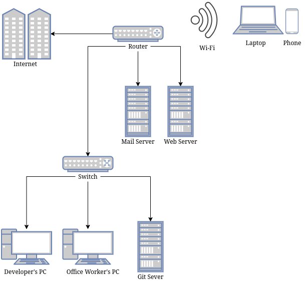
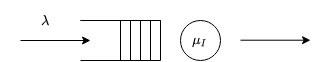

# Network Architecture

## Interpretation of the scenario

The company has many requirements. It needs a website, an email system, a version control system for software development, office software on some of the PCs and a remote desktop system. The website and email systems are for selling mugs, providing customer support and contacting customers. Specialised software will be installed on some of the devices to enable office tasks to be performed. The remote desktop system would allow employees to work from home.

## Technical requirements
- Web Server.
- Email Server.
- Git server.
- Applications to perform office tasks installed on office worker's PCs.
- SSH enabled PCs and Virtual Network Computing (VNC) for GUI applications.

## Topology

{ width=300px }

### Components
- Switch
- Router
- 3 Servers:
    - Git Server
    - Email Server
    - Web Server

I chose a star topology. I chose this for a few reasons. First, it means that if there is a faulty cable only one node will go offline instead of having the whole network going down.

Second, it's scalable, this means that it's easy to add more nodes. Also if the office tasks department gets larger we can just install a new switch and have them be on their own LAN.

Third, it reduces collisions on the network. When there's high traffic and 2 devices transmit at the same time, both requests will go through as opposed to a bus topology where we would need a medium access control to decide who sends when. This will slow the network down.

I decided to split up the three services into three servers to have multiple points of failure. If we hosted all the services on one server then when the server went down the email system, the website and the git server will all be inaccessible.

## Specific products

### NETGEAR GS324TP 24 Port [@GS350]

This is a network switch. This will connect to our router and allow us to route packets on the local network. It operates at OSI layer 2

It has 24 ports which is an optimal amount as there won't be that many devices to begin with on the network. When we expand we can purchase more switches . It's energy efficient which will help with power costs and will reduce our environmental impact. It's an managed switch which means that we can monitor network traffic to manage network health. We can also create up to 64 Virtual Local Area Networks (VLANs) if we want to partition our network when it gets bigger.

Some additional features that make it the best choice include DoS prevention to keep out network up when under attack, and rate limiting and priority queueing for better bandwidth allocation.

I think this is the optimal choice due to these features, it allows us to scale well and it is cost effective compared to other switches on the market.

### Cisco RV340 Router [@Cisco]

This is a router. This will connect our network to other networks. It operates at OSI layer 3.

It's supports both Wi-Fi and Ethernet which will allow our workers to use whatever device they want on the network.

It also provides a 3G/4G failover via USB modem. This means that if the Wi-Fi fails for any reason, there will be a 3G/4G backup connection. This will help with ensuring the network stays online during critical periods.

It also provides an in built antivirus which analyses packets sent through these protocols.

- HTTP
- FTP
- SMTP
- POP3
- IMAP

## Addressing schemes

Each device on my network will have a network interface card (NIC). Each NIC will have a MAC Address assigned to it which will identify that device on the network. However, this form of addressing will only work with other devices on the same local network. For devices outside our local network we'll need to translate these MAC addresses into IP addresses.

On our network, the Dynamic Host Configuration Protocol (DHCP) protocol will assign devices an IP Address when they connect. These IP addresses contain both the location of the device and the location of the network. On my network it'll use classless inter domain routing (CIDR) as opposed to classful addressing which wastes space in the IP address.

The IP address is a 32 bit number. We need to split this up into both a network part and a device part. To do this we would use a subnet. This is another number that we can use to logically **AND** the IP address to find out the network address.

For example:

IP Address 14.166.140.017 **AND** Network Mask 255.255.000.000 **EQUALS** Network Address 14.166.000.000.

This IP address is much more readable than the MAC address that looks like this: "a4:c3:f0:e6:62:84". It's a lot more readable, however when we connect to a website we don't type in IP addresses as it would be hard to memorise. Instead we use the Domain Name System (DNS)

DNS translates human readable addresses like www.smartmugs.co.uk. into IP addresses like 43.245.43.74, DNS does this by reading the human readable address from right to left.

The root server (the dot at the end of the URL) is queried for the name server of the next part of the URL in this case `.uk` and recursively goes down the tree. If we had to do this for every time you resolved a domain then it'd take ages, instead we cache these mappings.

In reality we don't do this. If we did then many computers would be querying the root servers resulting in a massive load on a few servers. We actually query the local name server for the domain and if it isn't in the cache then it would resolve it the recursive way. Now anyone who queries that local domain server will get the cached result, reducing the load on the root name servers.[@systems-approach]

Our customers would use our domain name to access our website. Our workers won't need to use DNS too often. They may use it to access other websites or perhaps our FTP server (if we give it a domain name).

## Security Issues on the network

In order to translate an IP address into a MAC address we need to use the Address Resolution Protocol (ARP).

- First the packet arrives from the internet to our local network.
- We have an IP address which maps to a device on the network, however we need the MAC address in order to transfer the packets.
- The host then broadcasts a **WHO-HAS** message with the IP address to every node on the network.
- A host with that IP Address responds with a **IS-AT** message with a MAC address.
- The host will cache that mapping for a while. [@lectures]

The security issue with this is that a hacker could respond with an **IS-AT** message even if they weren't the device that the packet was intended for. This would result in all the packets intended for the original node to be routed to this new malicious node until the cache is cleared. In our situation, this could lead to someone impersonating one of our workstations and obtaining a copy of our codebase.

This is called ARP spoofing and there are a few solutions for it. One method would be to have static ARP entries so only hard coded nodes would be able to receive packets. However, this is really tedious for when you want to add a lot of new nodes and won't scale well. A more practical yet less effective way to resolve this is to install ARP monitoring software such as *Arpwatch*. This logs MAC/IP mappings and can detect if two devices try to respond to the same **WHO-HAS** message. [@Network-Security-Hacks]

## Challenges and solutions of a local lockdown.

A local lockdown is a closure or reduced availability of businesses, schools and workplaces in a local area. Two issues would arise: Workers would be unable to access their local files/applications and they'll be unable to hold in-person meetings.

For accessing files there is a simple solution. We can set up a file server. A file server is just a computer that hosts files accessible over network or the internet depending on how we set it up. For our company we would set it up so that we can access it over the internet. The protocol used to transfer files would be SSL/FTP, we would use a login system to prevent malicious users from accessing our files. To prevent data loss if the disks fail we would use a RAID system on our file server. An alternative is a peer to peer system, it would be cheaper as there would be no need for a central server. However, it may be much slower than FTP if the workers serving their files have poor connections. In addition, you would need workers to keep their computers running in order to keep the files accessible by their co-workers.

For certain applications like command lines tools we can enable Secure Shell (SSH) on our computers. This will allow workers to log onto their remote machines, execute commands and edit their files. However, for more complex graphical applications like accounting software we'll need something different. We can use Virtual Network Computing (VNC) for this. This allows workers to connect into our machines from their computers at home and run graphical applications. To prevent overloading the network we can ask workers to only use this service if they don't have the software required at home already. This is because many people already have Microsoft Office at home and will have a better experience working on their local machine without latency and it means that there are less people on the network slowing it down.

For the meetings we can use an online service such as Zoom or Microsoft Teams. The main reasons for a third party service is that VoIP services such as Zoom have very good device compatibility and there's no maintenance cost. With a self hosted solution, mobile device support isn't very common and maintenance costs exist when you host it yourself.

# Application layer protocols

## HTTP/HTTPS

HyperText Transfer Protocol Secure (HTTPS) is a protocol to fetch or modify resources from a server. In our case we will use it to serve our website to customers. [@lectures]

The server will use HTTP to serve the website and the client's device would use HTTP to fetch the website.

One point of failure would be if the server goes down for whatever reason. It could be due to a power cut, tripping over wire or too many requests coming from customers. This means that instead of fetching our website, our customers would see a 503 HTTP error code which would result in lost sales.

Another point of failure would be if the customer uses a HTTP version that our server doesn't support.  

A security issue with HTTP is response splitting.[@response-split] In HTTP headers the \<CR>\<LF> (Carriage Return and Line feed) characters are used to denote the termination of a line. If we use these characters as part of the header anything after that sequence of characters will be sent to the server as if it were the data associated with the request. This could be used in many different ways to cause harm. You could redirect them to a malicious website or use cross site scripting (XSS) to inject dangerous JavaScript into the webpage. We can avoid response splitting by sanitising the input using type casting or regular expressions.

### HTTP Messages

#### Customer's request

~~~
GET HTTP/1.1
Host: www.smartmugs.co.uk/index.html
Content-Type: text/html
User-Agent: Mozilla/5.0 (X11; Ubuntu; Linux x86_64; rv:15.0) Gecko/20100101 Firefox/15.0.1
~~~

#### Server's response

~~~
HTTP/1.1 200 OK
Date: Tue, 17 Nov 2020 20:10:22 GMT
Content-Type: text/html; charset=UTF-8
Content-Length: 500
Last-Modified: Mon, 10 Nov 2020 10:11:23 GMT
Server: Apache/2.4.1 (Unix)

(INSERT BODY HERE)
~~~

## FTP/FTPS [@ftp]

File Transfer Protocol (FTP) is a protocol used for transferring files from one device to another. We'll use it to serve files to our workers while working remotely.

The components that would use this protocol would be our file server, and the worker's PC.

In FTP there are two modes. Active mode and Passive mode.

Passive mode is where the client connects from a random port to port 21 on the server. Then the client sends a PASV command which the server responds with random open port. The client connects from another random port to the server's random port, and data transfer occurs.

Active mode is where the client connects from a random port *N* where *N > 1023* to the FTP server's command port, port 21. Then the client listens on port *N+1* and sends back the command PORT *N+1*. The server will now connect to the client's port *N+1* from it's local port 20.

A potential cause of failure for the protocol would be firewalls. In passive mode the client opens a random port and the server connects to that random port. Modern computers often have firewalls that only allow certain ports to be accessed. This would result in our server's connection to our client being blocked. The solution to this is to use active mode as the server doesn't have to connect to the client's random port and therefore won't be blocked.

The result of both of these failures is that our workers wouldn't be able to access their files and therefore we'd lose productivity.

The major security issue of FTP is that the entire protocol is unencrypted. This means that anyone can see which files our workers are downloading which may leak sensitive files. To resolve this we can use FTPS, this adds TLS/SSL encryption to FTP. This is symmetric encryption of our files with identity authentication. [@lectures]

### FTP messages

~~~
. 2020-12-16 21:40:30.326 Session name: anonymous@speedtest.tele2.net (Ad-Hoc site)
. 2020-12-16 21:40:30.326 Host name: speedtest.tele2.net (Port: 21)
. 2020-12-16 21:40:30.326 User name: anonymous (Password: Yes, Key file: No, Passphrase: No)
. 2020-12-16 21:40:30.326 Transfer Protocol: FTP
. 2020-12-16 21:40:30.326 Ping type: Dummy, Ping interval: 30 sec; Timeout: 15 sec
. 2020-12-16 21:40:30.326 Disable Nagle: No
. 2020-12-16 21:40:30.326 Proxy: None
. 2020-12-16 21:40:30.326 Send buffer: 262144
. 2020-12-16 21:40:30.326 UTF: Auto
. 2020-12-16 21:40:30.326 FTPS: None [Client certificate: No]
. 2020-12-16 21:40:30.326 FTP: Passive: Yes [Force IP: Auto]; MLSD: Auto [List all: Auto]; HOST: Auto
. 2020-12-16 21:40:30.326 Local directory: default, Remote directory: home, Update: Yes, Cache: Yes
. 2020-12-16 21:40:30.326 Cache directory changes: Yes, Permanent: Yes
. 2020-12-16 21:40:30.326 Recycle bin: Delete to: No, Overwritten to: No, Bin path:
. 2020-12-16 21:40:30.326 Timezone offset: 0h 0m
. 2020-12-16 21:40:30.326 --------------------------------------------------------------------------
. 2020-12-16 21:40:30.373 Connecting to speedtest.tele2.net ...
. 2020-12-16 21:40:30.373 Connected with speedtest.tele2.net. Waiting for welcome message...
< 2020-12-16 21:40:30.390 220 (vsFTPd 3.0.3)
> 2020-12-16 21:40:30.390 USER anonymous
< 2020-12-16 21:40:30.409 331 Please specify the password.
> 2020-12-16 21:40:30.409 PASS *********************
< 2020-12-16 21:40:30.511 230 Login successful.
> 2020-12-16 21:40:30.511 SYST
< 2020-12-16 21:40:30.531 215 UNIX Type: L8
> 2020-12-16 21:40:30.531 FEAT
< 2020-12-16 21:40:30.557 211-Features:
< 2020-12-16 21:40:30.557  EPRT
< 2020-12-16 21:40:30.557  EPSV
< 2020-12-16 21:40:30.557  MDTM
< 2020-12-16 21:40:30.557  PASV
< 2020-12-16 21:40:30.557  REST STREAM
< 2020-12-16 21:40:30.557  SIZE
< 2020-12-16 21:40:30.557  TVFS
< 2020-12-16 21:40:30.557 211 End
. 2020-12-16 21:40:30.578 Connected
~~~

# Performance bottlenecks

## Explaining the bottleneck

One potential bottleneck is the fact that we only have one web server. When customers access our site they send a HTTP GET request. This request tells the server what resource the user wants. The server then processes that request and sends back the relevant resource. However, if a user sends a GET request and the server receives another GET request from a second user, then the second user will be put into a queue until the first GET request is resolved. This is a oversimplification of how a web server really works but I'll be using this model to analyse performance as it's simple. The reason why web server performance matters is because customers are impatient.
What I mean by this is that if pages take longer to load users are more likely to click off leading to lost sales. For example one study showed that 40% of users will abandon a web page if it takes more than 3 seconds to load. [@bounce]

## Why queueing theory?

I'll be using queueing theory to analyse the web server's performance. The reason why I'm choosing queueing theory over measuring a physical network is because I don't have the resources to build a network. Also, if I do build it and it turns out to be really inefficient, then I would have to rebuild it taking even more time and money. Another alternative is discrete event simulation, this is where we model a system as a sequence of events. When an event finishes we move onto the next event. The reason for choosing queueing theory over this is the fact that we don't have any real world values to put into our simulation. We could put a range of values in, however, this may take a very long time.

## Modelling a web server

Queuing theory models a system as jobs, queues and servers. The jobs arrive at rate $\lambda$ and get processed at the servers at rate $\mu$. If a job arrives and the server is busy it gets placed into the queue.
In our system we'll receive HTTP GET requests from users. The job involves processing the request, building the dynamic web page and sending it over the internet back to the user.

We'll model our system as a M/D/1 Queue. The M stands for a markovian arrival process. [@wiki]

This assumes 2 things:

- That arrivals don't change based on time. I.e In any second the probability of users visiting the site remains the same.

- That arrivals are memoryless. What I mean by that is that just because a few users visit our site in quick succession, it doesn't impact the probability of another user also visiting a few moments later.

D stands for a deterministic service process. I've chosen this as processing a HTTP GET request and building a web page will take a specific amount of time.

1 stands for a single server. We assume an infinite queue length, and a first come first served serving style.

$\lambda$ would be the average number of HTTP requests we get per second.

$\mu$ would be the average number of HTTP requests we process per second. This could be influenced by many things, the clock speed, the file sizes etc...

We can use this formula to estimate the average waiting time:[@wiki]

$$E[R] = \frac{\rho \mu}{2(1-\rho)}$$

$$\rho = \frac{\lambda}{\mu}$$

{width=50%}
{width=50%}
\begin{figure}[!h]
\begin{subfigure}[t]{0.5\textwidth}
\caption{Angle 1}
\end{subfigure}
\hfill
\begin{subfigure}[t]{0.5\textwidth}
\caption{Angle 2}
\end{subfigure}
\caption{Plotting $\lambda$ against $\mu$ to estimate $E[R]$}
\end{figure}

From the images we can see that when the mean server speed $\mu$ > 100 it doesn't influence the mean response time $E[R]$ at all.

On the contrary we can see that response time is *very* sensitive to changes in the mean arrival time $\lambda$.

We can translate $\lambda$ into a 'hits per day' value by multiplying $\lambda$ by  60\*60\*24  =  86400. [@http-queue] The response time goes over the 2 second limit around when $\lambda =  4$. Translating that to hits per day we get a value of 345600 hits a day. This seems like a lot, probably much more traffic than we'll ever receive selling smart mugs so it's unlikely to be an issue.

However, if we were to get these kind of numbers there a few ideas to increase performance, two of these ideas would be adding another server and increasing the speed of the server. As I stated before increasing the speed of the server is unlikely to impact performance. The second idea is to add a second server. An analysis^[@http-queue By Khaled M. Elleithy] has shown that adding another server with the same speed has a negligible effect. Even worse is the fact that if we add a faster or slower server, then performance will actually decrease.

The code here if you want to recreate the image as it's quite hard to see in the pictures.

~~~ Python
from mpl_toolkits import mplot3d
from matplotlib import pyplot as plt
from matplotlib import cm
import numpy as np

def response_time(pps, hps):
    util = hps/pps
    numerator = (util * pps)
    denominator = 2 * (1 - util)
    return numerator/denominator

# need hits/sec to be same len as proc/sec
pps = np.linspace(30, 100, 1000) #jobs processed per sec
hps = np.linspace(0, 15, 1000) #jobs arriving per sec

PPS, HPS = np.meshgrid(pps, hps)
RTIME = response_time(PPS, HPS)

# getting a plane at z=2
xx,yy = np.meshgrid(pps, hps)
zz = (xx * 0) + 2

ax = plt.axes(projection='3d')
ax.plot_wireframe(PPS, HPS, RTIME, color='black')
ax.plot_surface(xx,yy,zz, color='white')
ax.set_xlabel('Jobs Processed/Sec')
ax.set_ylabel('Jobs Arriving/Sec')
ax.set_zlabel('Response Time');
plt.show()
~~~

## Caveats

There are **many** issues with this model.

- We're ignoring the low level details of TCP/IP. The 3 way handshake takes time to initiate, and sending the packets takes time depending on the user's and the server's bandwidth.
- Users have different internet speed so, this means that the time taken to send a web page to a customer will vary. This results in non-deterministic service times.
- It doesn't take into account the fact that web pages are usually cached on the user's machine. If a customer visits the website and then visits again five minutes later, they won't need to redownload the webpage as they'll have it stored from the last time they visited.
- Modern servers can handle more than one concurrent connection as they can use threading.

# Dependability issues

A potential dependability issue is a faulty router. This would mean that our servers and workstations wouldn't be able to communicate with devices outside of the network or local devices (depending on where they are in the network). This would result in the inability to transfer files, serve our website, communicate with each other etc.

There are a few reasons why the router may go down: the machine may lose power, firmware bugs or heat related issues etc. The reason we have this issue is because we have only one router. If that router goes down we don't have another one.

## Availability

A suitable metric to assess how dependable the network is availability.

For this I'm assuming the rest of the network is reliable and that the router is repairable.

Availability is calculated using $\frac{MTBF}{MTBF+MTTR}$ [@reliability]

- MTBF = Mean Time Between Failure
- MTTR = Mean Time To Repair

The MTBF of the RV340 router is 50000 hours [@Cisco]. However, we don't have any MTTR figures as the network hasn't been deployed and no data has been provided by Cisco.

Instead I've created a figure showing the availability from a MTTR of (0 to 31 days). I chose 31 days as I think it would be the time it would take to deliver a new router when the delivery companies are under load from people ordering stuff during a lockdown.

{height=300px}

The figure shows the probability of availability as MTTR increases. Due to the sturdiness of the CISCO router, the probability even doesn't drop below 0.994 after 31 days. This is pretty high, and means that our router is unlikely to cause dependability issues.

## Improving dependability

Despite the low probability of failure it *could* still happen. We can use the Cisco Hot Standard Router Protocol (HSRP) [@hsrp] to ensure near 100% uptime.

This involves adding another router to our network. This will act as a hot spare meaning that when the active router fails the second router will take over.

{height=200px}

A virtual router is created that is assigned an virtual IP and MAC address. This IP address is then used as the default gateway of the network. The virtual router then forwards the packets from the network to one of the two routers. The two routers continually exchange status messages so the backup router can continue routing for the active router if the active router fails. When the main router falls and the backup router is activated the devices on the network wouldn't notice a thing. To them they're just sending to the same default gateway meaning no interruption in service.

# References
