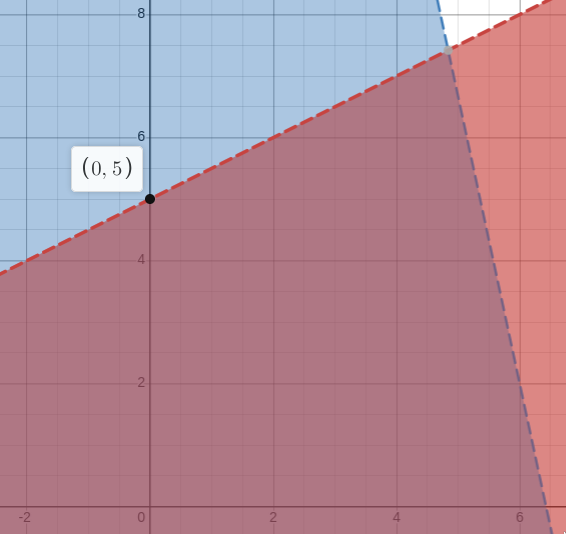
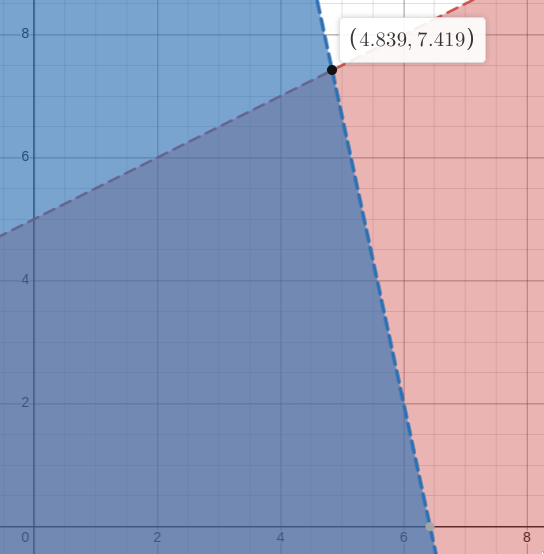
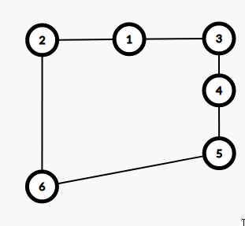

# Question 1

## 1.a 

Let $P_{chop}$ be the number of chopping boards we make, and $P_{knife}$ be the number of knife holders we make. These will be our decision variables.

Our constraints will be:

$1.4 \cdot P_{chop} + 0.8 \cdot P_{knife} \leq 56$

$5 \cdot P_{chop} + 13 \cdot P_{knife} \leq 650$

$P_{chop} \geq 0$

$P_{knife} \geq 0$

Our objective function will be:

$maximise(2 \cdot P_{chop} + 6 \cdot P_{knife})$

## 1.b

### 1.b.i
+---------+---------+---------+---------+-----+----+
| $x_{1}$ | $x_{2}$ | $s_{1}$ | $s_{2}$ | $z$ |    |
+=========+=========+=========+=========+=====+====+
| -5      | 10      | 1       | 0       | 0   | 50 |
+---------+---------+---------+---------+-----+----+
| 14      | 3       | 0       | 1       | 0   | 90 |
+---------+---------+---------+---------+-----+----+
| -8      | -30     | 0       | 0       | 1   | 0  |
+---------+---------+---------+---------+-----+----+

### 1.b.ii

We first select the pivot column. -30 is the smallest number in the bottom row. So the 2nd row is column is selected.
Next we select the pivot row. $\frac{90}{3} > \frac{50}{5}$, so the first row is selected.

Next we perform the row reduction step.
We'll label the 3 rows $R_{1}, R_{2}$ and $R_{3}$.

$R_{1} \rightarrow \frac{R_{1}}{10}$

$R_{2} \rightarrow R_{2} - 3 \cdot \frac{R_{1}}{10}$

$R_{3} \rightarrow R_{3} + 30 \cdot \frac{R_{1}}{10}$

+---------+---------+---------+---------+-----+----+
| $x_{1}$ | $x_{2}$ | $s_{1}$ | $s_{2}$ | $z$ |    |
+=========+=========+=========+=========+=====+====+
| -1/2    | 1       | 1/10    | 0       | 0   | 5  |
+---------+---------+---------+---------+-----+----+
| 31/2    | 0       | -3/10   | 1       | 0   | 75 |
+---------+---------+---------+---------+-----+----+
| -23     | 0       | 3       | 0       | 1   | 150| 
+---------+---------+---------+---------+-----+----+

{width=50mm}

Next select the next pivot column. -23 is the smallest number in the bottom row. $\frac{31}{2}$ is the only non-negative number. 

$R_{1} \rightarrow R_{1} + \frac{1}{2} \cdot \frac{2}{31} \cdot R_{2}$

$R_{2} \rightarrow \frac{2}{31} \cdot R_{2}$

$R_{3} \rightarrow R_{3} + 23 \cdot \frac{2}{31} \cdot R_{2}$

+---------+---------+---------+---------+-----+--------+
| $x_{1}$ | $x_{2}$ | $s_{1}$ | $s_{2}$ | $z$ |        |
+=========+=========+=========+=========+=====+========+
| 0       | 1       | 14/155  | 1/31    | 0   | 230/31 |
+---------+---------+---------+---------+-----+--------+
| 1       | 0       | -3/155  | 2/31    | 0   | 150/31 |
+---------+---------+---------+---------+-----+--------+
| 0       | 0       | 396/155 | 46/31   | 1   | 8100/31| 
+---------+---------+---------+---------+-----+--------+

{width=50mm}

# Question 2

## 2.a

The class of linear programming problems can said to fall under the class of *combinatorial* optimisation problems because as seen by the graphical method, the feasible space is a convex shape. The optimal solution to the linear program will be at one of the vertices of this shape and there will be a finite number of them. Therefore, the problem is reduced to finding the optimal solution from this finite set of vertices. This also applies to problems with more than 2 vairables. In those cases, the polygon will be in n-dimensional space.

## 2.b

Removing the edges $(1,6)$ and $(5,2)$ and adding the edges $(6,5)$ and $(1,2)$ we obtain the tour below.

{width=50mm}
 
## 2.c 

Integer linear programs are, in general, computationally intracable. ILPs can be used to solve problems in NP such as the Travelling Salesman problem. Therefore, if ILPs were computationally tractable, then TSP would also be tractable.

## 2.d 

For this problem we'll pick $x_{1}$ to be our branching variable.

From this we obtain 2 sub-problems that we can perform LP relaxtion on.

\begin{align*}
&\text{if } x_{1} = 0                       & &\text{if } x_{1} = 1\\
&\text{maximise } z = -3x_{2} - 15x_{3}     & &\text{maximise } z = 7 - 3x_{2} - 15x_{3}\\
&3x_{2} - 4x_{3} \leq 37                    & &3x_{2} - 4x_{3} \leq 36\\
&x_{2} \leq 0                               & &x_{2} \leq 1\\
&x_{1} = 0                                  & &x_{1} = 1\\
&0 \leq x_{j} \leq 1, \text{ for } j = 2, 3 & &0 \leq x_{j} \leq 1, \text{ for } j = 2, 3
\end{align*}

## 2.e

### Decision Variables

The decision variables will be represented by $x_{i,j} \in \{1, 0\}$ where $i$ and $j$ represent player $i$ and player $j$.

If $x_{i,j}$ is 1, then the player $i$ is higher up in the ranking than player $j$. $(i > j)$.

If $x_{i,j}$ is 0, then the player $j$ is higher up in the ranking that player $i$. $(j < i)$.

There will be 2 decision variables $x_{i,j}$ and $x_{j,i}$ for each pair $(i,j), i \neq j$ in the tournament. 

For example, if there were 3 players, the decision variables would be $x_{1,2}, \, x_{2, 1}, \, x_{2,3}, \, x_{3,2}, \, x_{3, 1}, \, x_{1, 3}$.

We need 2 sets of decision variables because the tournament matrix $[a_{i,j}]$ encodes the matchup $(i,j)$ and $(j, i)$ seperately.

### Objective Function

The objective function will be 

$$minimise \sum_{i = 1}^{n} \sum_{j = 1, j \neq i}^{n} x_{i,j} \cdot a_{j,i}$$

This sums over all the matchups. 

If $x_{i,j} = 1$ and $j$ beat $i$ in the tournamnent, then we add this to our score that we're minimising.

If $x_{i,j} = 0$ or $i$ beat $j$ in the tournamnent, then nothing happens to the score.

### Constraints

The first constraint is $x_{i,j} + x_{j,k} - x_{i,k} \leq 1$. We apply this constraint to all triplets of decision variables.

This is only violated when $x_{i,j} = 1, \, x_{j,k} = 1, \, x_{i,k} = 0$ as show by the truth table below. This corresponds to a situation where $i > j$ and $j > k$ and $k > i$ which breaks transitivity.

| $x_{i,j}$ | $x_{j,k}$ | $x_{i,k}$ | $x_{i,j} + x_{j,k} - x_{i,k}$ | $x_{i,j} + x_{j,k} - x_{i,k} \leq 1$ |
|-----------|-----------|-----------|-------------------------------|--------------------------------------|
| 1         | 1         | 1         | 1                             | True                                 |
| 1         | 1         | 0         | 2                             | False                                |
| 1         | 0         | 1         | 0                             | True                                 |
| 1         | 0         | 0         | 1                             | True                                 |
| 0         | 1         | 1         | 0                             | True                                 |
| 0         | 1         | 0         | 1                             | True                                 |
| 0         | 0         | 1         | -1                            | True                                 |
| 0         | 0         | 0         | 0                             | True                                 |

The next constraint is $x_{i,j} + x_{j,i} = 1$. We apply this this constraint to all pairs of decision variables.

This performs 2 functions, it ensures that, for any two distinct players, one is ranked above the other. 

It also ensures that at least one of $(i > j)$, $(j > i)$ is true, but not both. You can see this from the truth table below.

This means that all distinct pairs are ranked and prevents an inconsistent ranking.

| $x_{i,j}$ | $x_{j,i}$ | $x_{i,j} + x_{j,i}$ | $x_{i,k} + x_{j,i} = 1$ |
|-----------|-----------|---------------------|-------------------------|
| 1         | 1         | 2                   | False                   |
| 1         | 0         | 1                   | True                    |
| 0         | 1         | 1                   | True                    |
| 0         | 0         | 0                   | False                   |

The final constraint is $x_{i, j} \in \{0, 1\}$. We apply this constraint to every decision variable.

This means ensures that when we select a $i > j$ in the ranking, it's a binary choice. 

# Question 3

## 3.a

### 3.a.i

The probability that B will be chosen for selection first is 0.35. This is because the probability it is chosen first is calculated by $5/(4 + 5 + 2 + 3)$ 

### 3.a.ii

The expected number of times that C will be chosen in the next population is 0.571. This is because the expected number of times is $n \cdot f(x)/ \sum_{y \in P} = (4 \cdot 2) / 14$.

### 3.a.iii

The number of times we'll select A with Stochastic Universal Sampling is 2.

This is because, the probablity of A being chosen is $4/(4+5+2+3) = 0.286$. This covers over a quarter of the roulette wheel, which means that it's guaranteed to hit 2 of the arrows.

## 3.b

You would want to to use Stochastic Universal Sampling when you have a lower population size.

This is because with small population sizes and roulette wheel selection the actual number of times a chromosone is selected can vary a lot from it's expected value.

Stochastic Universal sampling solves this issue.

## 3.c

An example of a pair of offspring from $A$ and $B$, is:

- 1011010
- 0000111

This corresponds to the crossover point after the second bit.

## 3.d

A schema representing the set is 1\*\*0\*.

The order of this schema is 2, the defining length is 3.

## 3.e

### 3.e.i

Two aspects that simulating annealing and genetic algorithms have in common, that isn't shared with tabu search are:

1. They both use random number generators. Simulated annealing uses it to decide to go uphill or not, and genetic algorithms uses it to select chromosones. Tabu search doesn't use random numbers.

2. They both don't prevent you from moving to specific neighbours, wheras tabu search does, with it's tabu list.

### 3.e.ii

One aspect that simulated annealing and tabu search have in common, that isn't shared with genetic algorithms is that they use neighbourhood functions to get a new neighbourhood.

Genetic algorithms use crossover and mutation to generate new neighbours.

# Question 4

## 4.a

### 4.a.i

| Constraint | Changes          | Added                        |
|------------|------------------|------------------------------|
| $(B,A)$    | $B = \{3, 4 \}$  | $(A,B), (C,B), (E,B), (F,B)$ |
| $(E,B)$    | $E = \{6\}$      | $(B,E), (C,E), (F,E), (H,E)$ |
| $(D,C)$    | $D = \{5, 6\}$    | $(C,D), (A,D), (F,D), (G,D)$ |
| $(G,H)$    | $G = \{4, 5, 7\}$ | $(D,G), (C,G), (F,G), (H,G)$ |
| $(G,C)$    | $G = \{5, 7\}$    | $(D,G), (C,G), (F,G), (H,G)$ |
| $(G,D)$    | $G = \{5\}$       | $(D,G), (C,G), (F,G), (H,G)$ |
| $(D,G)$    | $D = \{5\}$       | $(C,D), (A,D), (F,D), (G,D)$ |
| $(B,C)$    | $B = \{3\}$       | $(A,B), (C,B), (E,B), (F,B)$ |
|            | No more Changes   |                              |

## 4.a.ii

$\{B, E\}$ is not path consistent with $C$ because the assignment $\{B = 2, E = 4\}$ is consistent with $\{B, E\}$. However this cannot be extended to an assignment $\{B = 2, E = 4, C = c\}$ that satisfies $\{B, C\}$ and $\{E, C\}$. 

This is because the only value in C's domain is $2$, which does not satisfy the constrain $|B - C| \neq 1$ and $|E - C| \neq 1$.

## 4.b

**Inital Table**

+----------------+--------+--------+--------+--------+--------+--------+--------+--------+
|                | A      | B      | C      | D      | E      | F      | G      | H      |
+================+========+========+========+========+========+========+========+========+
| Inital Domains | 1,2,3, | 1,2,3, | 1,2,3, | 1,2,3, | 1,2,3, | 1,2,3, | 1,2,3, | 1,2,3, |
|                | 4,5    | 4,5,6, | 4,5,6, | 4,5,6, | 4,5,6, | 4,5,6, | 4,5,6, | 4,5,6, |
|                |        | 7,8    | 7,8    | 7,8    | 7,8    | 7,8    | 7,8    | 7,8    |
+----------------+--------+--------+--------+--------+--------+--------+--------+--------+
| C = 1          | 3,4,5, | 3,4,5, | 1\*    | 3,4,5, | 3,4,5, | 3,4,5, | 3,4,5, | 2,3,4, |
|                | 6,7,8  | 6,7,8  |        | 6,7,8  | 6,7,8  | 6,7,8  | 6,7,8  | 5,6,7, |
|                |        |        |        |        |        |        |        | 8      |
+----------------+--------+--------+--------+--------+--------+--------+--------+--------+
| F = 8          | 3,4,5, | 3,4,5, | 1\*    | 3,4,5, | 3,4,5, | 8\*    | 3,4,5, | 2,3,4, |
|                | 6,7,8  | 6,7,8  |        | 6      | 6      |        | 6      | 5,6    |
+----------------+--------+--------+--------+--------+--------+--------+--------+--------+
| B = 3          | 5,6,7  | 3\*    | 1\*    | 4,5,6  | 5,6    | 8\*    | 4,5,6  | 2,4,5, |
|                |        |        |        |        |        |        |        | 6      |
+----------------+--------+--------+--------+--------+--------+--------+--------+--------+
| E = 5          | 6,7    | 3\*    | 1\*    | 4,6    | 5\*    | 8\*    | 4,6    | 2      |
+----------------+--------+--------+--------+--------+--------+--------+--------+--------+

**2nd iteration**

+----------------+--------+--------+--------+--------+--------+--------+--------+--------+
|                | A      | B      | C      | D      | E      | F      | G      | H      |
+================+========+========+========+========+========+========+========+========+
| Inital Domains | 1,2,3, | 1,2,3, | 1,2,3, | 1,2,3, | 1,2,3, | 1,2,3, | 1,2,3, | 1,2,3, |
|                | 4,5    | 4,5,6, | 4,5,6, | 4,5,6, | 4,5,6, | 4,5,6, | 4,5,6, | 4,5,6, |
|                |        | 7,8    | 7,8    | 7,8    | 7,8    | 7,8    | 7,8    | 7,8    |
+----------------+--------+--------+--------+--------+--------+--------+--------+--------+
| C = 1          | 3,4,5, | 3,4,5, | 1\*    | 3,4,5, | 3,4,5, | 3,4,5, | 3,4,5, | 2,3,4, |
|                | 6,7,8  | 6,7,8  |        | 6,7,8  | 6,7,8  | 6,7,8  | 6,7,8  | 5,6,7, |
|                |        |        |        |        |        |        |        | 8      |
+----------------+--------+--------+--------+--------+--------+--------+--------+--------+
| F = 8          | 3,4,5, | 3,4,5, | 1\*    | 3,4,5, | 3,4,5, | 8\*    | 3,4,5, | 2,3,4, |
|                | 6,7,8  | 6,7,8  |        | 6      | 6      |        | 6      | 5,6    |
+----------------+--------+--------+--------+--------+--------+--------+--------+--------+
| B = 3          | 5,6,7  | 3\*    | 1\*    | 4,5,6  | 5,6    | 8\*    | 4,5,6  | 2,4,5, |
|                |        |        |        |        |        |        |        | 6      |
+----------------+--------+--------+--------+--------+--------+--------+--------+--------+
| E = 5          | 6,7    | 3\*    | 1\*    | 4,6    | 5\*    | 8\*    | 4,6    | 2      |
+----------------+--------+--------+--------+--------+--------+--------+--------+--------+
| H = 2          | 6,7    | 3\*    | 1\*    | 4,6    | 5\*    | 8\*    | 4,6    | 2\*    |
+----------------+--------+--------+--------+--------+--------+--------+--------+--------+

Here we pick H = 2 because of the mimimum remaing value heuristic. There is only one value to choose, so we'll fix that. There are no values to elimnate from forward checking

**3rd Iteration**

+----------------+--------+--------+--------+--------+--------+--------+--------+--------+
|                | A      | B      | C      | D      | E      | F      | G      | H      |
+================+========+========+========+========+========+========+========+========+
| Inital Domains | 1,2,3, | 1,2,3, | 1,2,3, | 1,2,3, | 1,2,3, | 1,2,3, | 1,2,3, | 1,2,3, |
|                | 4,5    | 4,5,6, | 4,5,6, | 4,5,6, | 4,5,6, | 4,5,6, | 4,5,6, | 4,5,6, |
|                |        | 7,8    | 7,8    | 7,8    | 7,8    | 7,8    | 7,8    | 7,8    |
+----------------+--------+--------+--------+--------+--------+--------+--------+--------+
| C = 1          | 3,4,5, | 3,4,5, | 1\*    | 3,4,5, | 3,4,5, | 3,4,5, | 3,4,5, | 2,3,4, |
|                | 6,7,8  | 6,7,8  |        | 6,7,8  | 6,7,8  | 6,7,8  | 6,7,8  | 5,6,7, |
|                |        |        |        |        |        |        |        | 8      |
+----------------+--------+--------+--------+--------+--------+--------+--------+--------+
| F = 8          | 3,4,5, | 3,4,5, | 1\*    | 3,4,5, | 3,4,5, | 8\*    | 3,4,5, | 2,3,4, |
|                | 6,7,8  | 6,7,8  |        | 6      | 6      |        | 6      | 5,6    |
+----------------+--------+--------+--------+--------+--------+--------+--------+--------+
| B = 3          | 5,6,7  | 3\*    | 1\*    | 4,5,6  | 5,6    | 8\*    | 4,5,6  | 2,4,5, |
|                |        |        |        |        |        |        |        | 6      |
+----------------+--------+--------+--------+--------+--------+--------+--------+--------+
| E = 5          | 6,7    | 3\*    | 1\*    | 4,6    | 5\*    | 8\*    | 4,6    | 2      |
+----------------+--------+--------+--------+--------+--------+--------+--------+--------+
| H = 2          | 6,7    | 3\*    | 1\*    | 4,6    | 5\*    | 8\*    | 4,6    | 2\*    |
+----------------+--------+--------+--------+--------+--------+--------+--------+--------+
| D = 4          | 6,7    | 3\*    | 1\*    | 4\*    | 5\*    | 8\*    | 6      | 2\*    |
+----------------+--------+--------+--------+--------+--------+--------+--------+--------+

Here we pick D = 4. We pick D because the minimum remaining value heuristic ended up in a tie. Therfore we used the degree heuristic. D had a degree of 2 wheras A and G had a degree of 1. 

We pick D = 4 because 4 is the least constraining choice out. It's removes 1 value from G's domain. Wheras picking 6 would remove 2 values from A and 1 value from G. 

**4th Iteration**

+----------------+--------+--------+--------+--------+--------+--------+--------+--------+
|                | A      | B      | C      | D      | E      | F      | G      | H      |
+================+========+========+========+========+========+========+========+========+
| Inital Domains | 1,2,3, | 1,2,3, | 1,2,3, | 1,2,3, | 1,2,3, | 1,2,3, | 1,2,3, | 1,2,3, |
|                | 4,5    | 4,5,6, | 4,5,6, | 4,5,6, | 4,5,6, | 4,5,6, | 4,5,6, | 4,5,6, |
|                |        | 7,8    | 7,8    | 7,8    | 7,8    | 7,8    | 7,8    | 7,8    |
+----------------+--------+--------+--------+--------+--------+--------+--------+--------+
| C = 1          | 3,4,5, | 3,4,5, | 1\*    | 3,4,5, | 3,4,5, | 3,4,5, | 3,4,5, | 2,3,4, |
|                | 6,7,8  | 6,7,8  |        | 6,7,8  | 6,7,8  | 6,7,8  | 6,7,8  | 5,6,7, |
|                |        |        |        |        |        |        |        | 8      |
+----------------+--------+--------+--------+--------+--------+--------+--------+--------+
| F = 8          | 3,4,5, | 3,4,5, | 1\*    | 3,4,5, | 3,4,5, | 8\*    | 3,4,5, | 2,3,4, |
|                | 6,7,8  | 6,7,8  |        | 6      | 6      |        | 6      | 5,6    |
+----------------+--------+--------+--------+--------+--------+--------+--------+--------+
| B = 3          | 5,6,7  | 3\*    | 1\*    | 4,5,6  | 5,6    | 8\*    | 4,5,6  | 2,4,5, |
|                |        |        |        |        |        |        |        | 6      |
+----------------+--------+--------+--------+--------+--------+--------+--------+--------+
| E = 5          | 6,7    | 3\*    | 1\*    | 4,6    | 5\*    | 8\*    | 4,6    | 2      |
+----------------+--------+--------+--------+--------+--------+--------+--------+--------+
| H = 2          | 6,7    | 3\*    | 1\*    | 4,6    | 5\*    | 8\*    | 4,6    | 2\*    |
+----------------+--------+--------+--------+--------+--------+--------+--------+--------+
| D = 4          | 6,7    | 3\*    | 1\*    | 4\*    | 5\*    | 8\*    | 6      | 2\*    |
+----------------+--------+--------+--------+--------+--------+--------+--------+--------+
| G = 6          | 7      | 3\*    | 1\*    | 4\*    | 5\*    | 8\*    | 6\*    | 2\*    |
+----------------+--------+--------+--------+--------+--------+--------+--------+--------+

Here we pick G = 6 because it has the least remaining values. There's only one choice to make.
We remove 6 from A's domain from forward checking.

**5th Iteration**

+----------------+--------+--------+--------+--------+--------+--------+--------+--------+
|                | A      | B      | C      | D      | E      | F      | G      | H      |
+================+========+========+========+========+========+========+========+========+
| Inital Domains | 1,2,3, | 1,2,3, | 1,2,3, | 1,2,3, | 1,2,3, | 1,2,3, | 1,2,3, | 1,2,3, |
|                | 4,5    | 4,5,6, | 4,5,6, | 4,5,6, | 4,5,6, | 4,5,6, | 4,5,6, | 4,5,6, |
|                |        | 7,8    | 7,8    | 7,8    | 7,8    | 7,8    | 7,8    | 7,8    |
+----------------+--------+--------+--------+--------+--------+--------+--------+--------+
| C = 1          | 3,4,5, | 3,4,5, | 1\*    | 3,4,5, | 3,4,5, | 3,4,5, | 3,4,5, | 2,3,4, |
|                | 6,7,8  | 6,7,8  |        | 6,7,8  | 6,7,8  | 6,7,8  | 6,7,8  | 5,6,7, |
|                |        |        |        |        |        |        |        | 8      |
+----------------+--------+--------+--------+--------+--------+--------+--------+--------+
| F = 8          | 3,4,5, | 3,4,5, | 1\*    | 3,4,5, | 3,4,5, | 8\*    | 3,4,5, | 2,3,4, |
|                | 6,7,8  | 6,7,8  |        | 6      | 6      |        | 6      | 5,6    |
+----------------+--------+--------+--------+--------+--------+--------+--------+--------+
| B = 3          | 5,6,7  | 3\*    | 1\*    | 4,5,6  | 5,6    | 8\*    | 4,5,6  | 2,4,5, |
|                |        |        |        |        |        |        |        | 6      |
+----------------+--------+--------+--------+--------+--------+--------+--------+--------+
| E = 5          | 6,7    | 3\*    | 1\*    | 4,6    | 5\*    | 8\*    | 4,6    | 2      |
+----------------+--------+--------+--------+--------+--------+--------+--------+--------+
| H = 2          | 6,7    | 3\*    | 1\*    | 4,6    | 5\*    | 8\*    | 4,6    | 2\*    |
+----------------+--------+--------+--------+--------+--------+--------+--------+--------+
| D = 4          | 6,7    | 3\*    | 1\*    | 4\*    | 5\*    | 8\*    | 6      | 2\*    |
+----------------+--------+--------+--------+--------+--------+--------+--------+--------+
| G = 6          | 7\*    | 3\*    | 1\*    | 4\*    | 5\*    | 8\*    | 6\*    | 2\*    |
+----------------+--------+--------+--------+--------+--------+--------+--------+--------+
| A = 7          | 7\*    | 3\*    | 1\*    | 4\*    | 5\*    | 8\*    | 6\*    | 2\*    |
+----------------+--------+--------+--------+--------+--------+--------+--------+--------+

There's only one value to set. 
