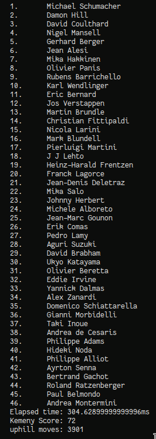

# Definition of neighbourhood

The definition of my neighbourhood N is as follows.

For a ranking $R_{1}$ we can obtain a new ranking by first selecting a random player in the ranking as a pivot, then swap that player with an adjacent player in the ranking.

For example:

1. Let $R_{1} = [1, 2, 3, 4, 5]$.
2. Select $3$ as the pivot element.
3. We can swap $3$ with either $2$ or $4$, let's choose $4$.
4. From this we can obtain $R_{2} = [1, 2, 4, 3, 5]$

In practice we always swap the selected element with the one to it's right to ensure we only ever have to generate one random number per neighbourhood.

The cost of $R_{2}$, $C(R_{2})$ can be easily computed from the swaps made to create $R_{2}$ from $R_{1}$ and $C(R_{1})$.

1. let $R_{1} = [1, 2, 3, \dots, k, k+1, \dots, k+n]$
2. From $R_{1}$ obtain a new ranking $R_{2}$ by swapping $k$ and $k+1$. 
3. Set new score $C(R_{1})'$ to $C(R_{1})$.
4. If in the tournament $k$ beat $k+1$:
    - Then add the matchup $(k, k + 1)$'s weight to $C(R_{1})'$
5. If in the tournament $k + 1$ beat $k$:
    - Then subtract the matchup $(k + 1, k)$'s weight from $C(R_{1})'$
6. Set $C(R_{2})$ to $C(R_{1})'$

This runs in constant time.

# Simulated Annealing Parameter Selection

I found that the best parameters for me are:

- TI = 0.45
- TL = 162500
- $a$ in $f(T) = a \times T$ = 0.99
- `num_non_improve (nni)` = 1

With these we can get an average score of 72.88 with an average runtime of 303ms

I tried a range of parameters, and the one that had the biggest effect was changing the temperature length. 
I've tested with grid search the ranges TL \-> [1000, 200000] and `nni` \-> [100, 100000]

What I've found is that there are 2 main approaches. You can have a large temperature length and a low `nni`, or a large `nni` and a small temperature length. 

I tried both approaches and found that you can achieve good scores with really quick runtimes (25ms - 80ms) with the latter. However, this approach also give higher variance in kemeny score and runtime. Scores hover around 71 to 75, but up to 90 on certain runs. 

In contrast, setting a low `nni` with a high temperature length achieves the opposite. We can obtain consistently good scores (71 to 75) with high runtimes, with variance decreasing as we increase the temperature length. In fact we can achieve an average of 71.25 score with the parameter TL = 500000, `nni` = 1, but with runtimes of 1000ms. With these parameters we're only doing one pass of the outer loop. Therefore, with this configuration of the parameters the cooling ratio doesn't matter and we must set the initial temperature to a low number. However, too low of a TI and we don't make enough uphill moves, I found that a TI of 0.475 gives good results.

As for the existence of local optima, when running my program, even for a large number of iterations, with many uphill moves it can get stuck on non-optimal solutions. After observing these non-optimal solutions, almost all of the time they're unalike. This indicates that they're unique local optimas. Therfore I speculate that there are many local optimas.

# Figures

{height=75mm}

{height=50mm}

{height=50mm}

# Screenshots

